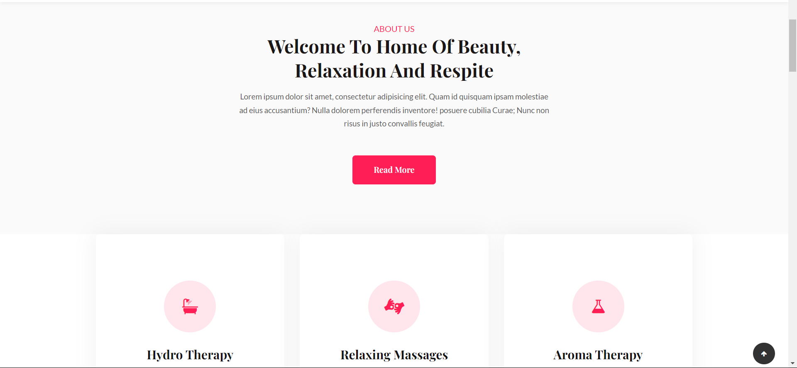
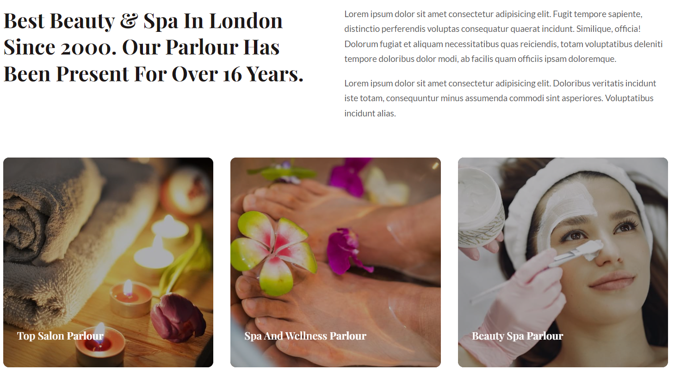
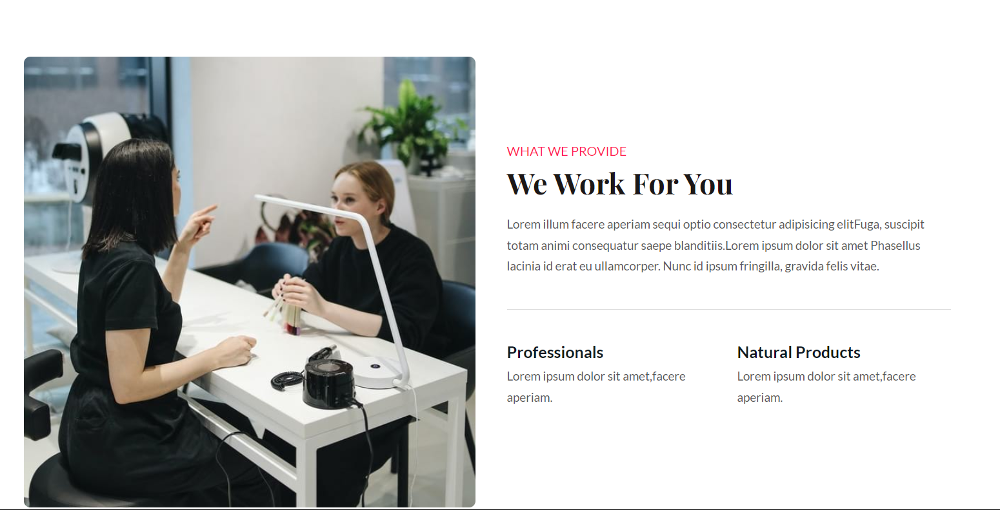
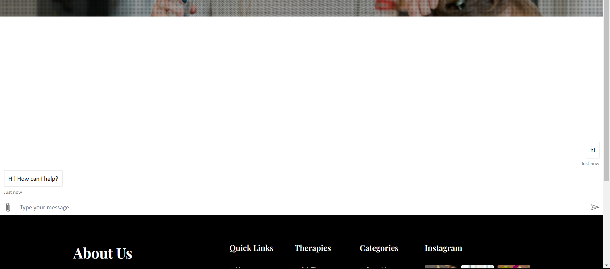
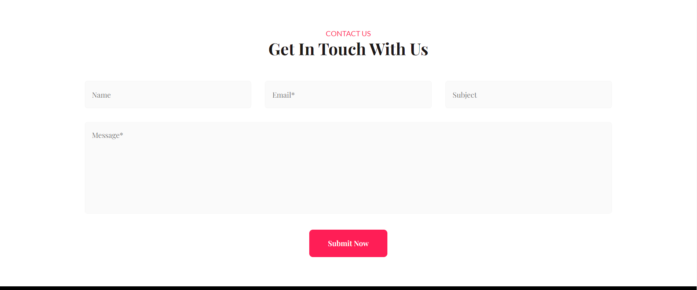

# Heaven to Heaven Spa
This is a web-based application developed for health-related based website in india

This web-based health application has been developed for the accomplishment of the Future Ready Talent Internship program launched by Microsoft, Future Skills Prime, Quess, Github and EY.

Project Link:- https://calm-sea-0f705a700.3.azurestaticapps.net/index.html
Demo Video:

# Azure technologies used for Project
* Static web apps
* Health bot

# Features and Functionalities
* Interactive and responsive UI.
* Has many graphical and visual innovative effects.
* Have an aesthetically pleasing visual design and architecture.
* Has collection of many web pages including Home, About Us, Contact, Menu, health topics and health related information etc.
* User can know about health information through this website.
* Included the feedback Survey form to increase the scope of improvement

# Screenshots

# Tech Stack

* Azure(Hosting)
* HTML
* CSS
* Bootstrap
* JavaScript
